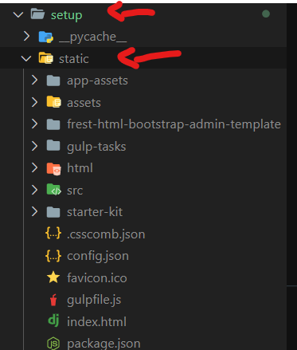

Falaaaaa, prof.
blz?

Vamos começar instalando os pacotes necessário com no seu ambiente virtual:
- Se for necessário instalar o ambiente virtual:
    - python -m venv venv

- Ativar o ambiente virtual:
    - {pasta do ambiente} ./venv/Scripts/activate

- Instalar os pacotes:
    pip install -r requirements.txt

Agora vamos lá
Criei o projeto chamado setup
- Dentro do projeto, criei um app chamado 'test'

Sempre que iniciar um app, mova o app criado para a pasta 'apps', pois deixei configurado dessa forma em 'settings.py'

O app 'test' só renderiza uma página html
- A função que faz isso é nomeada 'blank' e está em 'apps/test/views/views.py'

Criei a pasta 'templates'
- Na pasta 'templates' é para ter os html que serão renderizados
- Também contém a pasta 'partials' que é a abstração dos componentes repetidos nas páginas.
- Para criar uma página nova, sugiro copiar 'index.html' dentro de 'templates/test/index.html' e montar sua página

 ------------- NECESSÁRIO FAZER ISSO -------------------
É necessário criar uma pasta 'static' dentro de setup:
    setup/static
Nessa pasta: adicionar os arquivos estáticos do template, conforme indica a imagem

Subsituir o arquivo 'vendors.min.js' do template pelo 'vendors.min.js' que está no mesmo nível desse readme.
Pois o django estava reclamando de uma linha desse arquivo e eu deixei comentada.

Agora é só mandar bala :)